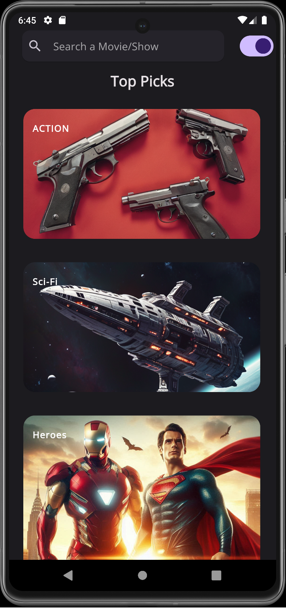
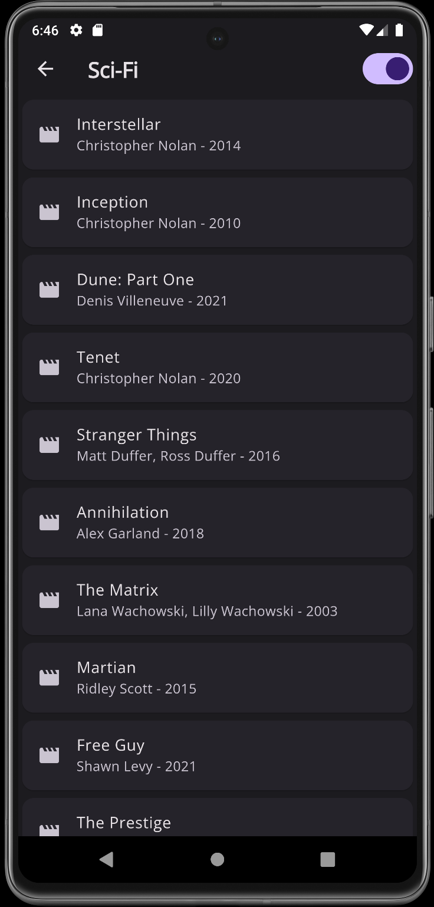
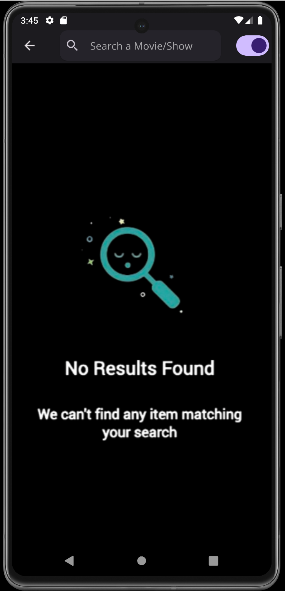

<h1 align="center">
  <strong>Mratings</strong>
</h1>

  

  
</a>

  
</a> 

<h3 align="center">
  <strong>A basic Flutter application providing reviews of desired movies/shows</strong>
</h3>

## 📌 Key Features

* **Search Functionality**: Easily search for review of the movie/show you desire to watch using the integrated search bar.
  
* **Collections**: I have made collections of top movies from each major genre in case you don't know what to watch(common issue).

* **Comprehensive Information**: Get comprehensive details including IMDb ratings, plot summaries, cast members, and directors of the searched movies/shows.

* **Light and Dark Mode**: Switch between light and dark mode with a simple toggle.

## 📡 APIs used

* [IMDb](https://rapidapi.com/apidojo/api/imdb8/)
* [Movies Tv Shoes Database](https://rapidapi.com/amrelrafie/api/movies-tv-shows-database)

## 👁️ Preview
Home Page             | Content Page           | Collections            | No Result Page
:-------------------:|:----------------------:|:----------------------:|:----------------------:
 |  |  | 

This is only the dark mode side of the application, to view light mode and some other screenshots, visit [here](https://github.com/im-lakshyaveerturna/Mratings/tree/main/Preview/pages)

## 🔖 Note

* The application is most likely to be developed further, any suggestions regarding the appearance or funtionality of the application will be much appreciated.
* This application was developed as an excercise to sharpen flutter/dart skills, therefore I do not expect the code or the application to be the best version of the intended project.
